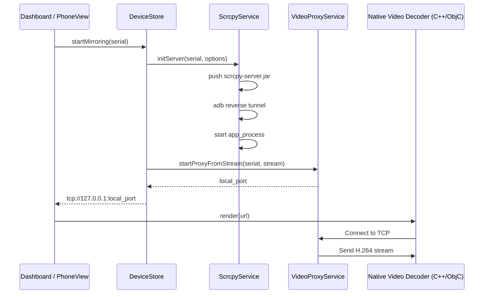

# Scraki Architecture

This document describes the high-level architecture of the Scraki project.

## Project Structure

Scraki follows **Clean Architecture** principles to ensure separation of concerns and maintainability.

- **`lib/core/`**: Contains cross-cutting concerns like DI (Dependency Injection), constants, error handling, and utilities.
- **`lib/domain/`**: The heart of the application. Contains Business Logic, Entities, and Repository Interfaces. This layer depends on nothing.
- **`lib/data/`**: Implementation of repository interfaces. Handles data retrieval from ADB, Scrcpy server, and local TCP sockets.
- **`lib/presentation/`**: The UI layer. Uses MobX for state management. Contains Screens, Widgets, and Stores.

## Core Components

### Mirroring Flow

The mirroring process involves several layers working together:

1.  **`DeviceStore` (Presentation)**: Orchestrates the mirroring process.
2.  **`ScrcpyService` (Data)**: Pushes the scrcpy server JAR to the device and starts it via ADB.
3.  **`ScrcpyClient` (Data)**: Sets up ADB reverse tunnels to receive video and control data.
4.  **`VideoProxyService` (Data)**: Receives the raw H.264/H.265 stream from the device and serves it via a local TCP port.
5.  **`NativeVideoDecoder` (Presentation)**: Connects to the local TCP port and uses native FFmpeg (via Flutter Texture) to decode and render the video with minimal latency.

## State Management (MobX)

We use **MobX** to manage application state.

- **Stores**: Contain `@observable` state, `@computed` properties, and `@action` methods.
- **Observers**: Widgets wrapped in `Observer` automatically rebuild when their observed state changes.

## Dependency Injection (GetIt & Injectable)

We use **GetIt** as a service locator and **Injectable** to automate the registration of dependencies.

- Use `@lazySingleton` for services and repositories.
- Run `flutter pub run build_runner build` to regenerate the injection configuration.
