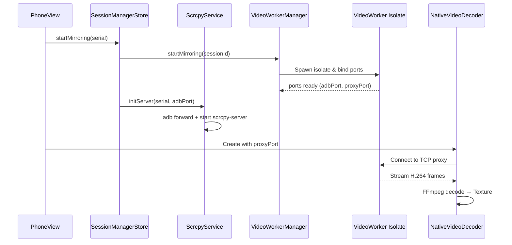
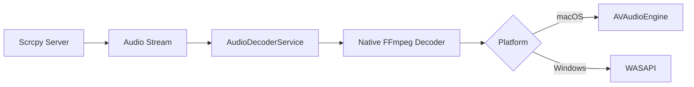

# Scraki Architecture

This document describes the architecture of Scraki after the **Feature-Clean Architecture** refactoring.

## Overview

Scraki follows **Feature-Based Clean Architecture** with strict **SOLID** principles, **MobX** state management, and **Dependency Injection** patterns.

## Directory Structure

```
lib/
├── core/                     # Shared utilities and global components
│   ├── di/                   # Dependency Injection setup (GetIt + Injectable)
│   ├── mixins/               # Reusable mixins (DiMixin, Store mixins)
│   ├── stores/               # Global application stores
│   │   ├── device_manager_store.dart       # Manages device list and connections
│   │   └── session_manager_store.dart      # Manages mirroring sessions
│   ├── network/              # Network clients (Dio, HTTP)
│   ├── utils/                # Utilities and extensions
│   └── widgets/              # Reusable UI components
│
├── features/                 # Feature modules (Clean Architecture)
│   ├── device/               # Device mirroring & management
│   │   ├── data/             # Repositories impl, datasources, DTOs
│   │   ├── domain/           # Entities, repository interfaces
│   │   └── presentation/     # Stores, screens, widgets
│   ├── poster/               # Poster creation feature
│   ├── dashboard/            # Dashboard feature
│   └── recruitment/          # Recruitment feature
│
├── data/                     # Legacy data layer (being migrated)
├── domain/                   # Legacy domain layer (being migrated)
└── main.dart
```

## State Management (MobX)

### Global Stores (`lib/core/stores/`)

**DeviceManagerStore**

- Manages device list (ADB devices)
- Handles device connections/disconnections
- Observable: `devices`, `isScanning`

**SessionManagerStore**

- Manages mirroring sessions (grid + floating)
- Handles session lifecycle (start/stop/switch modes)
- Observable: `activeSessions`, `floatingSessionId`, `deviceAspectRatio`

### Scoped Stores (`lib/features/*/presentation/stores/`)

Each feature has its own stores for local UI state:

- `PhoneViewStore`: Manages visibility tracking, file drag/drop, focus state
- `FloatingPhoneViewStore`: Manages floating window position, size, poster workflow
- `FloatingToolBoxStore`: Manages tool box UI state
- `DashboardStore`: Manages dashboard screen state

### Store Access Pattern

**Using Mixins (Recommended)**

```dart
class MyWidget extends StatelessWidget with DeviceManagerStoreMixin {
  Widget build(context) {
    return Observer(
      builder: (_) => Text('Devices: ${deviceManagerStore.devices.length}'),
    );
  }
}
```

**Direct Injection**

```dart
class MyWidget extends StatelessWidget with DiMixin {
  Widget build(context) {
    final store = inject<DeviceManagerStore>();
    return Observer(builder: (_) => ...);
  }
}
```

## Mirroring Architecture

### Video Mirroring Flow



### Performance Optimization

**Grid Mode (Low Performance)**

- Bitrate: 1 Mbps
- FPS: 10
- Resolution: Auto-scaled

**Floating Mode (High Performance)**

- Bitrate: 8 Mbps
- FPS: 60
- Resolution: Full device resolution

Sessions automatically restart with appropriate profile when switching modes.

### Audio Mirroring (macOS & Windows)



## Dependency Injection

### Setup (`lib/core/di/`)

```dart
@InjectableInit()
void configureDependencies() => getIt.init();
```

### Registration Patterns

**Global Stores** (`@singleton`)

```dart
@singleton
class DeviceManagerStore { }
```

**Services** (`@lazySingleton`)

```dart
@lazySingleton
class ScrcpyService implements IScrcpyService { }
```

**Scoped Dependencies** (Manual creation)

```dart
class PhoneViewStore {
  PhoneViewStore() : _scrcpyService = getIt<IScrcpyService>();
}
```

## Design Patterns

### Repository Pattern

All data access goes through repository interfaces:

```dart
// Domain layer (interface)
abstract class IDeviceRepository {
  Future<Either<Failure, List<Device>>> getDevices();
}

// Data layer (implementation)
@LazySingleton(as: IDeviceRepository)
class DeviceRepositoryImpl implements IDeviceRepository {
  final IAdbRemoteDataSource _adb;
  // ...
}
```

### Observer Pattern (MobX)

Widgets automatically rebuild when observed state changes:

```dart
@observable
ObservableList<Device> devices = ObservableList();

@action
void addDevice(Device device) {
  devices.add(device); // Triggers UI rebuild
}
```

## Key Technical Decisions

### No setState Rule

- **All widgets** use MobX observables instead of `setState`
- **StatelessWidget + Observer** pattern for reactive UI
- Enforced through code reviews and linting

### Lifecycle Management

**Global Stores**: Singleton, live for app lifetime
**Scoped Stores**: Created/disposed with widget lifecycle

```dart
class _MyWidgetState extends State<MyWidget> {
  late final MyStore _store;

  @override
  void initState() {
    super.initState();
    _store = MyStore(); // Create
  }

  @override
  void dispose() {
    _store.dispose(); // Cleanup
    super.dispose();
  }
}
```

### Isolate Communication

Video/Audio workers run in separate isolates for max performance:

- **SendPort/ReceivePort** for bidirectional communication
- **Zero-copy** data transfer using `TransferableTypedData`
- **Dedicated isolate per session** ensures isolation

## Testing Strategy

### Unit Tests

- Test stores in isolation
- Mock repository interfaces
- Test domain entities and use cases

### Widget Tests

- Test UI with mock stores
- Verify Observer rebuilds
- Test user interactions

### Integration Tests

- Test full mirroring flow
- Verify isolate communication
- Test state persistence

## Migration Path (from Legacy)

1. **Phase 1-2**: Core setup + Global stores ✅
2. **Phase 3**: Feature migration (Device, Poster, Dashboard) ✅
3. **Phase 4**: Import path fixes ✅
4. **Phase 5**: setState removal ✅
5. **Phase 6**: Documentation ✅
6. **Phase 7**: Cleanup

See [Implementation Plan](file:///Users/anhkiet/.gemini/antigravity/brain/eb0c0154-0d1a-4737-adc2-337e2e4ba241/implementation_plan.md) for details.
