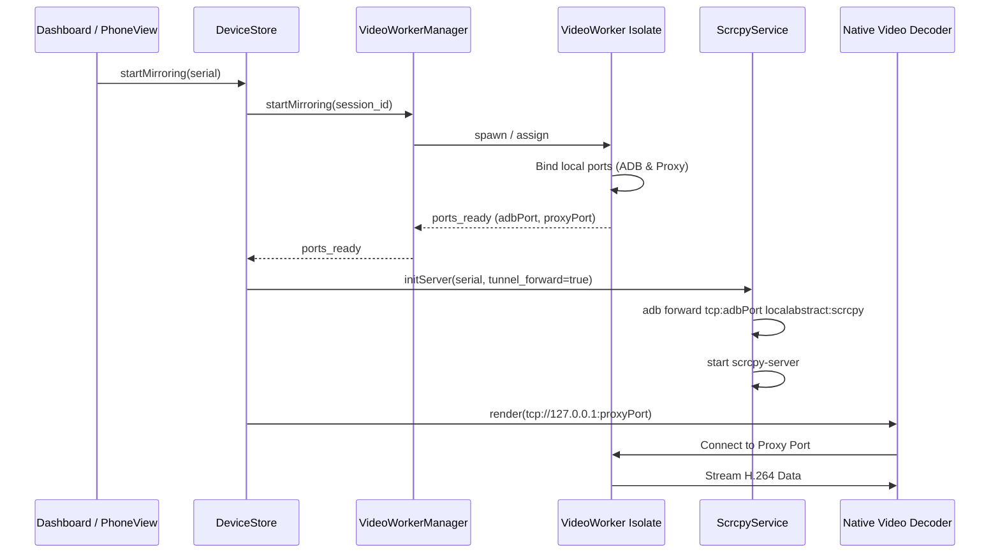
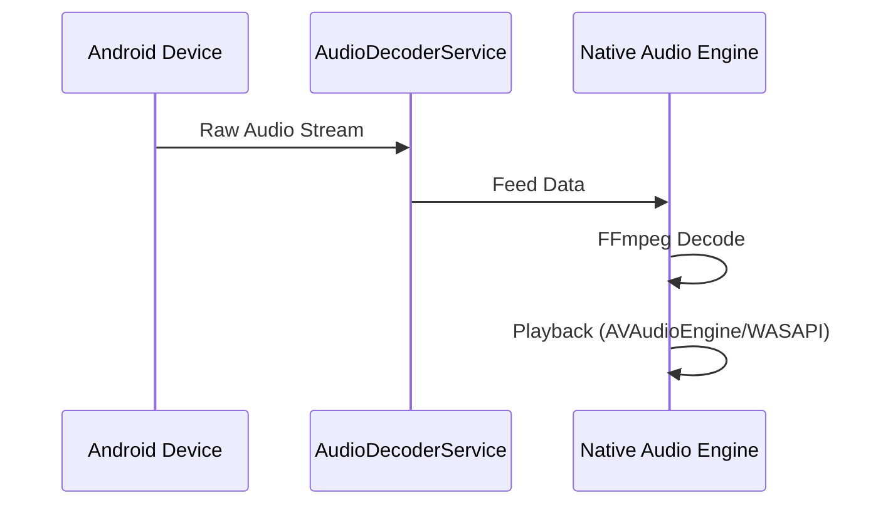

# Scraki Architecture

This document describes the high-level architecture of the Scraki project.

## Project Structure

Scraki follows **Clean Architecture** principles to ensure separation of concerns and maintainability.

- **`lib/core/`**: Contains cross-cutting concerns like DI (Dependency Injection), constants, error handling, and utilities.
- **`lib/domain/`**: The heart of the application. Contains Business Logic, Entities, and Repository Interfaces. This layer depends on nothing.
- **`lib/data/`**: Implementation of repository interfaces. Handles data retrieval from ADB, Scrcpy server, and local TCP sockets.
- **`lib/presentation/`**: The UI layer. Uses MobX for state management. Contains Screens, Widgets, and Stores.

## Core Components

### Mirroring Flow

The mirroring process involves several layers working together, leveraging **Isolates** for high performance:

1.  **`DeviceStore` (Presentation)**: Orchestrates the mirroring process.
2.  **`ScrcpyService` (Data)**: Pushes the scrcpy server JAR to the device and starts it via ADB.
3.  **`VideoWorkerManager` (Data)**: Manages a pool of background Isolates. Assigns a dedicated worker to each mirroring session.
4.  **`VideoWorker Isolate` (Data)**:
    - Sets up ADB servers to receive video/control streams.
    - Parses the raw Scrcpy protocol.
    - Exposes a local TCP port for the video stream.
5.  **`NativeVideoDecoder` (Presentation)**: Connects to the local TCP port exposed by the Isolate and uses native FFmpeg (via Flutter Texture) to decode and render the video.

### Audio Mirroring Flow

Audio mirroring works similarly but uses a separate decoding pipeline:

1.  **Scrcpy Server**: Captures device audio and streams it.
2.  **`AudioDecoderService`**: Receives the raw audio stream.
3.  **Native Audio Decoder**:
    - **macOS**: Uses FFmpeg for decoding and `AVAudioEngine` for playback.
    - **Windows**: Uses FFmpeg for decoding and `WASAPI` for playback.

## State Management (MobX)

We use **MobX** to manage application state.

- **Stores**: Contain `@observable` state, `@computed` properties, and `@action` methods.
- **Observers**: Widgets wrapped in `Observer` automatically rebuild when their observed state changes.

## Dependency Injection (GetIt & Injectable)

We use **GetIt** as a service locator and **Injectable** to automate the registration of dependencies.

- Use `@lazySingleton` for services and repositories.
- Run `flutter pub run build_runner build` to regenerate the injection configuration.
